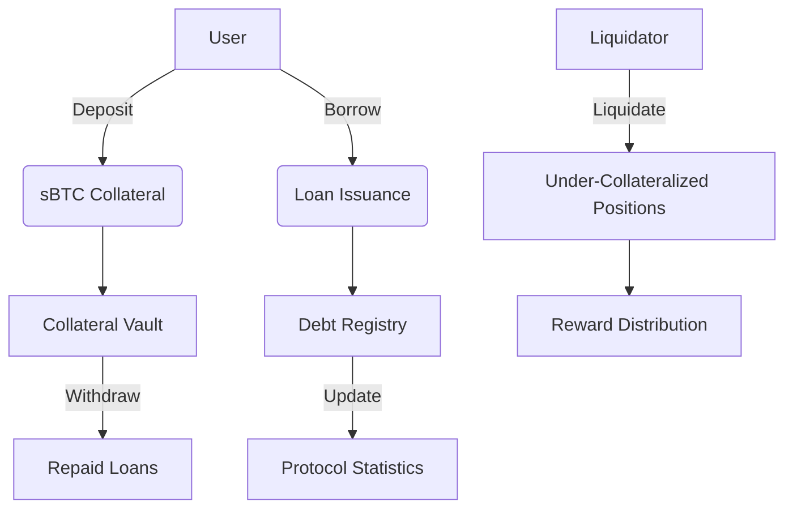

# Decentralized Lending Protocol - sBTC Collateralized Loans

A secure decentralized lending protocol enabling users to borrow against sBTC collateral with built-in liquidation mechanisms. This contract implements core DeFi lending primitives while maintaining safety through robust collateralization checks and administrative controls.

## Key Features

- **sBTC Collateralized Loans**

  - Deposit SIP-010 compliant sBTC as collateral
  - Borrow stablecoins/assets against collateral
  - Minimum 150% collateralization ratio

- **Risk Management**

  - Configurable liquidation threshold (70-95% LTV)
  - 5% liquidation rewards with safety caps
  - Real-time collateral health monitoring

- **Security First**

  - Pause functionality for emergency stops
  - Owner-restricted parameter updates
  - Safe arithmetic operations with overflow protection

- **Transparent Tracking**
  - Public view functions for positions
  - Real-time protocol statistics
  - Separate liquidation reward tracking

## Contract Architecture



## Core Functionality

### 1. Collateral Management

**Deposit Collateral**

```clarity
(deposit-collateral token-contract amount)
```

- Transfers sBTC from user to protocol
- Increases user's collateral balance
- Updates total protocol deposits

**Requirements:**

- `amount > 0`
- Protocol not paused
- Valid sBTC token contract

### 2. Loan Operations

**Borrow Funds**

```clarity
(borrow token-contract amount)
```

- Checks collateralization ratio (≥150%)
- Updates user's debt position
- Increases total protocol borrows

**Collateral Check:**

```math
(collateral * 10000) / (debt + new_borrow) ≥ 15000
```

**Repay Loan**

```clarity
(repay token-contract amount)
```

- Reduces user's debt balance
- Accepts partial repayments
- Updates total protocol borrows

### 3. Liquidation Engine

**Trigger Liquidation**

```clarity
(liquidate token-contract user amount)
```

- Available when:
  ```math
  (collateral * 10000) / debt ≤ liquidation_threshold
  ```
- Liquidator receives:
  ```math
  reward = min(amount * 1.05, collateral * 0.5)
  ```
- Debt and collateral reduced proportionally

**Claim Rewards**

```clarity
(claim-rewards token-contract)
```

- Transfers accumulated liquidation rewards
- Resets liquidator's reward balance

## Protocol Parameters

| Parameter               | Range  | Default | Description                       |
| ----------------------- | ------ | ------- | --------------------------------- |
| `MIN-COLLATERAL-RATIO`  | 150%   | Fixed   | Minimum collateralization ratio   |
| `interest-rate`         | 1-100% | 5%      | Annual interest rate (BPS)        |
| `liquidation-threshold` | 70-95% | 80%     | LTV ratio for liquidation trigger |
| Protocol Fee            | -      | 0%      | Currently not implemented         |

## Administrative Controls

**Owner Restricted Functions:**

```clarity
(set-interest-rate new-rate)
(set-liquidation-threshold new-threshold)
(pause-protocol)
(unpause-protocol)
```

**Safety Constraints:**

- Interest rate: 100-10,000 BPS (1%-100%)
- Liquidation threshold: 7,000-9,500 BPS (70%-95%)
- Protocol pausable by owner only

## Error Reference

| Code | Error                       | Description                    |
| ---- | --------------------------- | ------------------------------ |
| u100 | ERR-NOT-AUTHORIZED          | Unauthorized access attempt    |
| u101 | ERR-INSUFFICIENT-BALANCE    | Insufficient token balance     |
| u102 | ERR-INSUFFICIENT-COLLATERAL | Collateral below minimum ratio |
| u103 | ERR-INVALID-AMOUNT          | Invalid input amount           |
| u106 | ERR-LIQUIDATION-FAILED      | Liquidation conditions not met |

## Security Model

**Key Protections:**

1. Reentrancy prevention through CEI pattern
2. All token transfers use SIP-010 standard
3. Separate collateral and debt tracking
4. Arithmetic operations with overflow checks
5. Time-locked parameter changes (future upgrade)

**Liquidation Safeguards:**

- Maximum 50% collateral loss per liquidation
- 5% minimum incentive for liquidators
- Progressive debt reduction mechanism

## View Functions

**User Position Check:**

```clarity
(get-user-deposits user-principal)
(get-user-borrows user-principal)
```

**Protocol Analytics:**

```clarity
(get-protocol-stats)
```

Returns:

- `total-deposits`: Total sBTC locked
- `total-borrows`: Outstanding debt
- `interest-rate`: Current rate in BPS

## Development Notes

**Testing Checklist:**

1. Collateral ratio boundary conditions
2. Liquidation reward calculations
3. Protocol pause state interactions
4. Interest rate parameter validation
5. Cross-user isolation testing

**Dependencies:**

- SIP-010 compliant token contract
- STX blockchain v2.1+
- Clarity version 2.0
